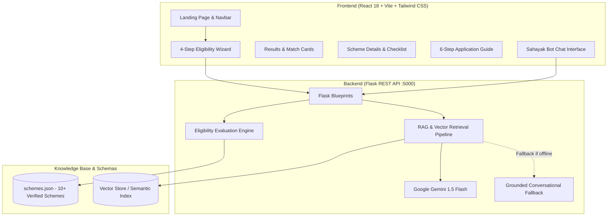

# 🇮🇳 SahayakAI – Government Scheme Assistant

[](https://react.dev)
[](https://flask.palletsprojects.com/)
[](https://ai.google.dev/)
[](./LICENSE)

> **"Find Government Schemes Made For You."**  
> An AI-powered citizen assistant that helps Indian citizens discover government welfare schemes they are eligible for, understand benefits in plain language, check document readiness, and navigate the application process step-by-step.

---

## 📌 Problem Statement

India hosts over 500+ Central and State welfare initiatives covering education, health, agriculture, housing, and social security. Despite billions in budgetary allocation:
1. **Information Asymmetry:** Most citizens are unaware of specific schemes designed for their income group, age, or occupation.
2. **Bureaucratic Jargon:** Official gazette notifications and eligibility rules are written in complex administrative language.
3. **Application Rejections:** Incomplete document preparation or minor mismatch (e.g. non-Aadhaar-seeded bank accounts) leads to rejection.
4. **Middleman Exploitation:** Low-income citizens often pay unnecessary commissions to unofficial intermediaries.

---

## 💡 Solution: SahayakAI

**SahayakAI** bridges the citizen-to-government divide by providing:
- **Zero-Storage Privacy Architecture:** No real Aadhaar or biometric data collected.
- **Automated Profile Match Engine:** Takes 12 simple citizen parameters and computes a realistic non-binding **Profile Match %**.
- **Bilingual RAG Chatbot ("Sahayak Bot"):** Understands questions in English, Hindi (हिंदी), and Hinglish with scheme citations.
- **Interactive Document Readiness Checklist:** Direct guidance on required proofs before applying.
- **6-Step Application Roadmap:** Simulated, risk-free application walkthrough with direct official portal links.

---

## 🏛️ System Architecture



---

## 🚀 Key Features

| Feature | Description |
| :--- | :--- |
| **⚡ 1-Click Hackathon Demo Profile** | Pre-fills the judge evaluation profile (20-year-old student, UP, ₹2,50,000 income, education need) in 1 click. |
| **🎯 Profile Match Scoring** | Evaluates criteria across age, income ceilings, student status, farmer status, gender, and social category. |
| **🤖 Sahayak Bot (Bilingual)** | Native support for queries in **English**, **हिंदी**, and **Hinglish**. Grounded in verified scheme data. |
| **📋 Document Checklist** | Interactive check-off for Aadhaar, income certificates, bonafide slips, and bank account readiness. |
| **🛡️ Privacy-First Demo Auth** | Simulated mobile login with demo OTP `123456`. Never requests real Aadhaar or confidential documents. |
| **🌐 Bilingual UI Toggle** | Instant toggle between **English** and **हिंदी** across headers, buttons, and sections. |
| **🔗 Official Portal Linking** | Direct clickable links to `scholarships.gov.in`, `pmkisan.gov.in`, `pmjay.gov.in`, `pmaymis.gov.in`, etc. |

---

## 📂 Project Structure

```text
SAHAYAK AI/
├── backend/
│   ├── app.py                     # Flask application entry point
│   ├── config.py                  # Env config & file paths
│   ├── requirements.txt           # Python dependencies
│   ├── .env.example               # Backend environment template
│   ├── test_backend.py            # Automated backend test suite
│   ├── data/
│   │   └── schemes.json           # Verified scheme database
│   ├── routes/
│   │   ├── schemes.py             # GET /api/schemes, GET /api/schemes/:id
│   │   ├── eligibility.py         # POST /api/check-eligibility
│   │   ├── chat.py                # POST /api/chat
│   │   └── guidance.py            # POST /api/application-guide
│   ├── services/
│   │   ├── eligibility_engine.py  # Criteria evaluation & match score logic
│   │   └── gemini_service.py      # Gemini API caller + grounded fallback
│   └── rag/
│       ├── embeddings.py          # Semantic term vectorizer
│       ├── vector_store.py        # Vector search (ChromaDB + Memory Store)
│       └── rag_service.py         # RAG pipeline orchestration
├── frontend/
│   ├── index.html                 # App title, fonts (Outfit & Inter), metadata
│   ├── package.json               # React, Vite, Tailwind CSS, Lucide icons
│   ├── vite.config.js             # Vite dev server with proxy to :5000
│   ├── tailwind.config.js         # Custom Indian civic design system theme
│   ├── src/
│   │   ├── components/
│   │   │   ├── Navbar.jsx         # Header, language switch, login status
│   │   │   ├── Footer.jsx         # Disclaimers, portals, helpline info
│   │   │   ├── DemoLoginModal.jsx # Simulated mobile + 123456 OTP modal
│   │   │   └── SchemeCard.jsx     # Scheme cards with match score badge
│   │   ├── pages/
│   │   │   ├── LandingPage.jsx    # Hero, preview, how it works, categories
│   │   │   ├── EligibilityWizard.jsx # 4-step wizard with demo prefill
│   │   │   ├── ResultsPage.jsx    # Ranked matches & category filters
│   │   │   ├── SchemeDetailPage.jsx # Plain-language benefits, documents checklist
│   │   │   ├── ApplicationGuidePage.jsx # 6-step interactive roadmap
│   │   │   ├── ChatbotPage.jsx    # Sahayak Bot (English/Hindi/Hinglish)
│   │   │   ├── SchemesDirectoryPage.jsx # All schemes directory & search
│   │   │   ├── DashboardPage.jsx  # Citizen overview & saved schemes
│   │   │   └── AboutPage.jsx      # Mission and principles
│   │   ├── context/
│   │   │   ├── AuthContext.jsx    # Demo user session & bookmarks
│   │   │   └── LanguageContext.jsx# Bilingual dictionary
│   │   ├── services/
│   │   │   └── api.js             # Frontend API client
│   │   ├── App.jsx                # Main layout and routing
│   │   ├── main.jsx
│   │   └── index.css              # Civic design CSS
├── data/
│   └── schemes.json               # Root scheme dataset
├── test_integration.py            # End-to-end proxy integration test
├── .gitignore
├── LICENSE
└── README.md
```

---

## 🛠️ Tech Stack

### Frontend
- **Framework:** React 18
- **Build Tool:** Vite
- **Styling:** Tailwind CSS (Custom Indian Civic Palette: `#0b2545`, `#f77f00`, `#1b998b`)
- **Icons:** Lucide React
- **Typography:** Google Fonts (`Outfit` for display headings, `Inter` for UI body)

### Backend
- **Framework:** Python Flask 3.x
- **CORS:** Flask-CORS
- **Configuration:** python-dotenv

### AI & Retrieval-Augmented Generation (RAG)
- **LLM:** Google Gemini 1.5 Flash (`generativelanguage.googleapis.com`)
- **RAG Engine:** Scheme chunk indexing, cosine similarity ranking, context-grounded prompt engineering.
- **Fail-Safe Fallback:** If `GEMINI_API_KEY` is not present, SahayakAI automatically runs the **Grounded Fallback Engine**, ensuring the hackathon demo **NEVER breaks**.

---

## ⚙️ Installation & Setup

### Prerequisites
- **Python 3.10+** (Tested on Python 3.14)
- **Node.js 18+** & **npm 9+**

### 1. Backend Setup

```bash
# Navigate to backend folder
cd backend

# Install Python dependencies
python -m pip install -r requirements.txt

# (Optional) Add your Google Gemini API Key in .env
# Copy example:
cp .env.example .env
# Edit .env:
# GEMINI_API_KEY=your_gemini_api_key_here

# Run backend unit tests to verify setup
python -u test_backend.py

# Start Flask backend server
python -u app.py
```
> The backend server starts on **`http://localhost:5000`**.

### 2. Frontend Setup

```bash
# In a separate terminal, navigate to frontend folder
cd frontend

# Install dependencies
npm install

# Start Vite development server
npm run dev
```
> The frontend application starts on **`http://localhost:5173`**.

---

## 🎬 Hackathon Demo Walkthrough (For Judges)

1. **Open Landing Page:**
   - Go to `http://localhost:5173/`.
   - Notice the trustworthy Indian civic design, hero headline, and live match preview card.
   - Click the **EN \| हिंदी** toggle in the top bar to verify instant bilingual language switching.
2. **Demo Citizen Login:**
   - Click **Demo Citizen Login** in the navbar.
   - Note the pre-filled demo mobile (`9876543210`) and OTP (`123456`).
   - Click **⚡ Instant 1-Click Demo Login**.
3. **1-Click Eligibility Evaluation:**
   - Click **Check My Eligibility** or **Get Started**.
   - Click the prominent gold banner: **⚡ Load Hackathon Demo Profile (Student, 20y, UP, ₹2.5L)**.
   - Click **Continue** through Steps 1 to 4 and press **Find My Schemes**.
4. **Inspect Recommendations:**
   - Observe **96% Profile Match** on **Post-Matric Scholarship for Higher Education (NSP)** and related technical scholarships.
   - Filter by categories: *Education*, *Healthcare*, *Housing*, *Agriculture*.
5. **Review Scheme Details & Document Checklist:**
   - Click **View Details & Checklist** on the top scholarship.
   - Read the plain-language benefits and mandatory document requirements.
6. **Simulated Application Guide:**
   - Click **Start Application Guidance**.
   - Walk through Steps 1 to 6 and check off items in the document preparation checklist.
7. **Ask Sahayak Bot:**
   - Click **Ask Sahayak Bot** in the top navigation.
   - Click one of the suggested prompts or type in **English**, **हिंदी**, or **Hinglish**:
     - *"Which government schemes am I eligible for?"*
     - *"मैं किन सरकारी योजनाओं के लिए पात्र हूँ?"*
     - *"Mujhe scholarship ke liye koi government scheme chahiye."*
   - Verify grounded responses with reference citations.

---

## 🛡️ Privacy & Responsible AI Notice

- **No Real PII:** SahayakAI does not collect, record, or store Aadhaar numbers, PAN cards, OTPs, or financial account credentials.
- **Informational Guidance Disclaimer:** SahayakAI provides informational recommendations based on publicly available government schemes. Final eligibility, approval, and fund sanction are strictly governed by the designated Union Ministries and State Departments.

---

## 🔮 Future Scope

- **Voice Assistant Integration:** Speech-to-text and text-to-speech for rural citizens with low literacy in 12 regional languages.
- **DigiLocker API Integration:** One-click automated document verification via official DigiLocker sandbox.
- **WhatsApp / Telegram Citizen Bot:** Multilingual automated assistance accessible over instant messaging.
- **State-Level Schemes Expansion:** Scalable scraper for 28 state welfare portals.

---

## 👥 Contributors

- **SahayakAI Hackathon Team**
- Built for the National Citizen Empowerment Hackathon 2026.
